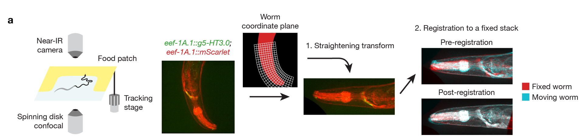
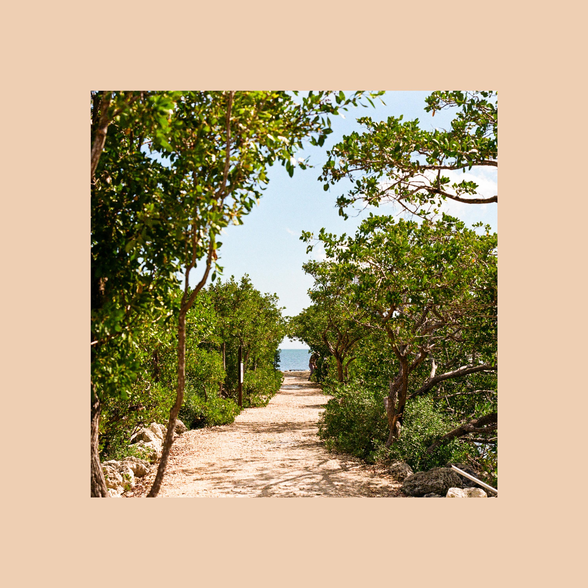
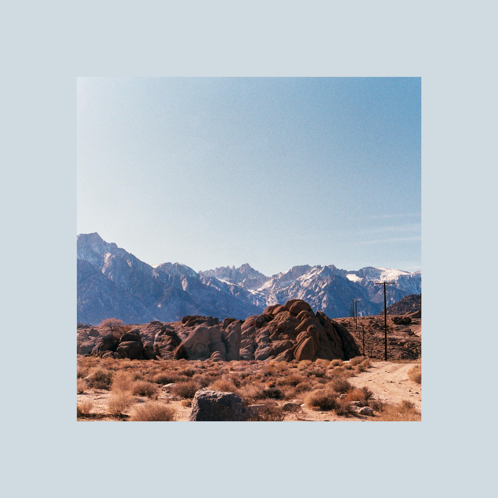
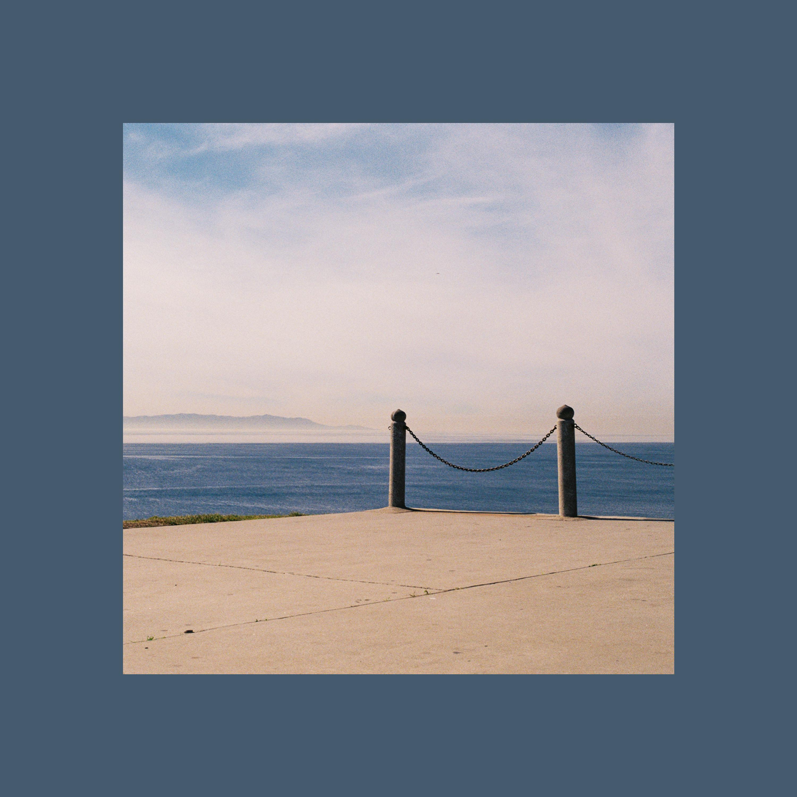
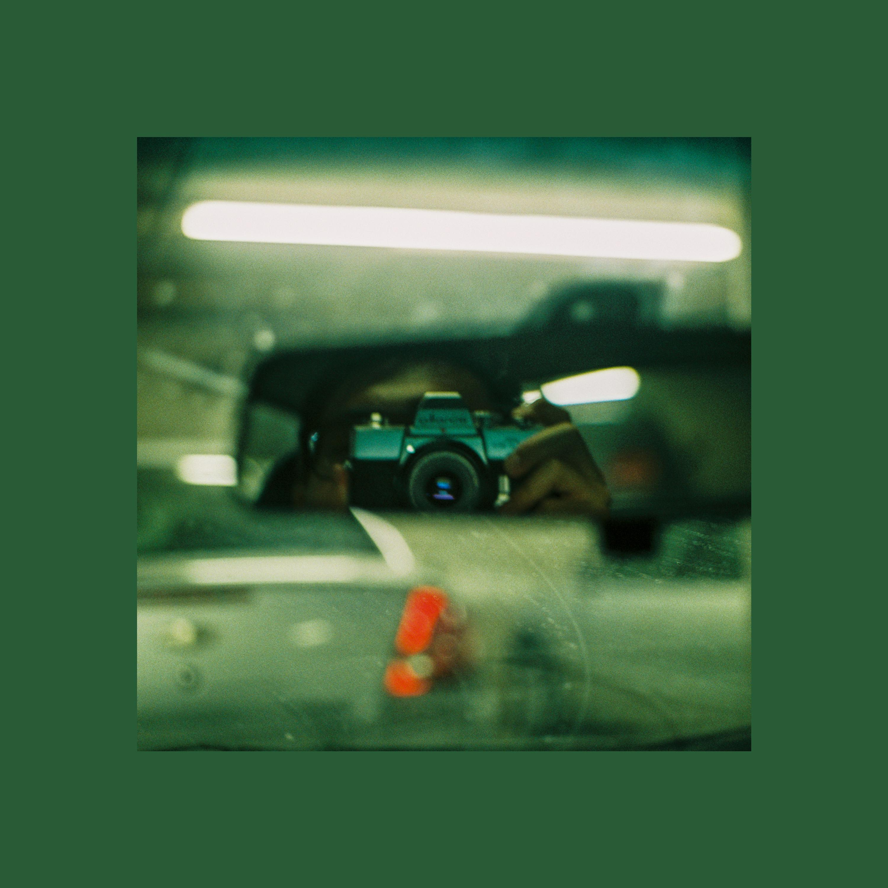
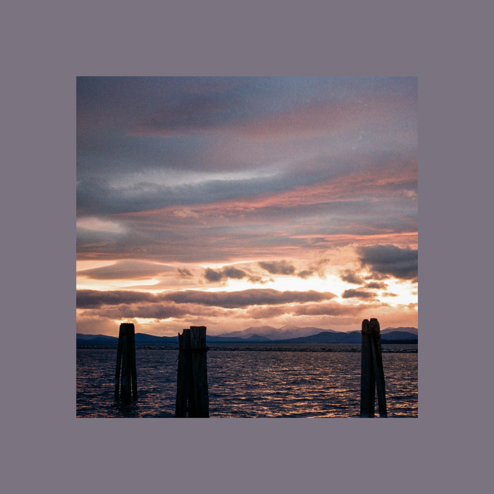
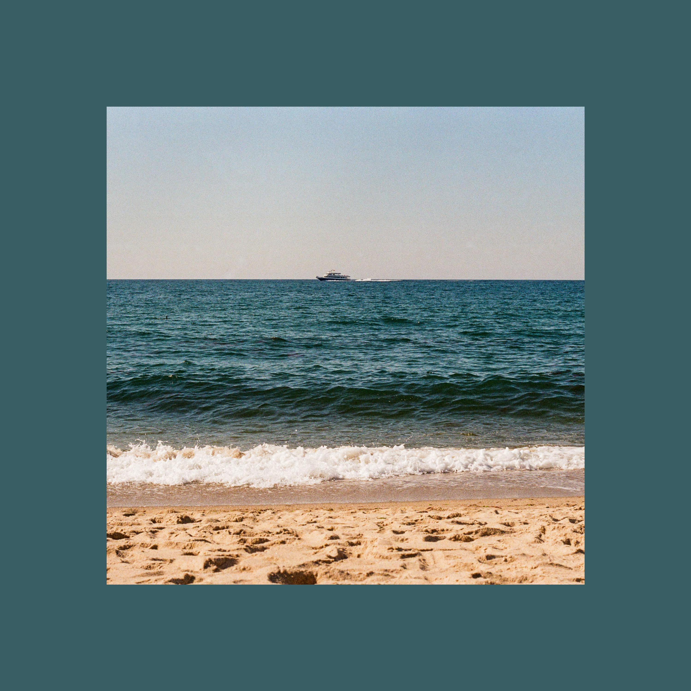
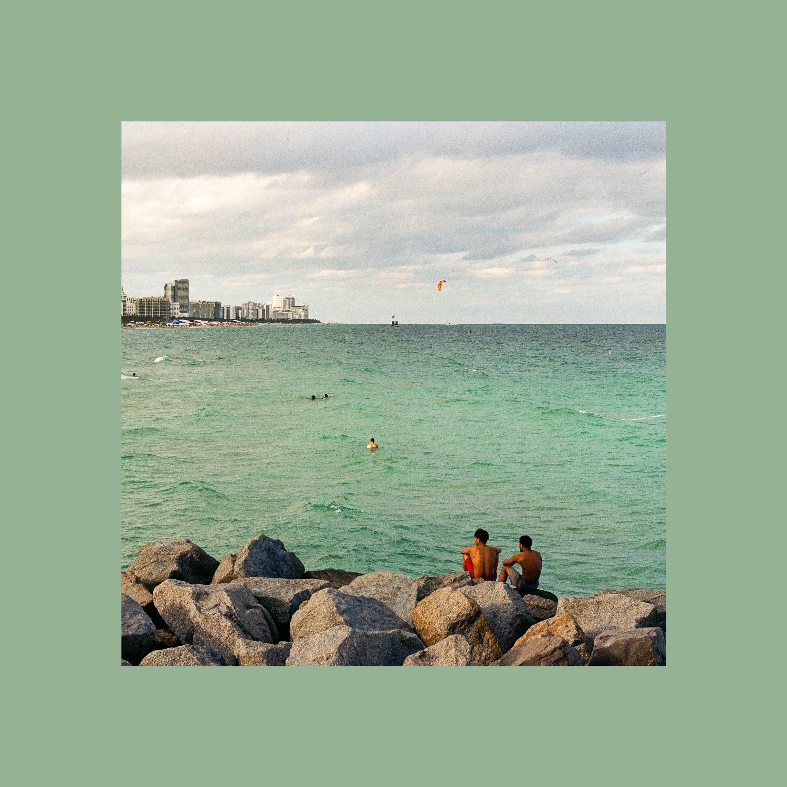

## Hello! I'm Albert 👋
I recently finished my PhD mapping 3D serotonin diffusion during behavior within the model neuroscience worm *C. elegans*. I have extensive experience at both the wet- and dry-lab from grad school and really enjoy collecting and analyzing imaging data. I’m excited by opportunities to tackle new analysis challenges on large-scale data and to continue expanding my data processing skill set!

## Grad school work 🔬🪱
* I was maybe what you could consider a “full-stack biologist” during my PhD and worked on all aspects of my project including: cloning and breeding new nematode strains expressing a genetically encoded fluorescent biosensor for serotonin, optimizing imaging protocols, recording my own datasets, and devising and implementing a novel analysis workflow for fixing deformations caused by movement during tracking confocal imaging.
* This pipeline, animated below, first extracts the body spline of the worm to inform a new coordinate transform for each frame to coarsely fix large deformations from body bending during movement. The pipeline then performs finer image registration to further align each image stack to a chosen reference stack from each recording.

## Computational skills 💻
**Languages:**  

**Image analysis:**       

**Visualization:**  

**Other:**     

## Some personal pics 📷
<table width="100%" cellpadding="0" cellspacing="0" style="border-collapse:collapse;">
  <tr>
    <td width="33%" style="padding:0;"></td>
    <td width="33%" style="padding:0;"></td>
    <td width="33%" style="padding:0;"></td>
  </tr>
  <tr>
    <td width="33%" style="padding:0;"></td>
    <td width="33%" style="padding:0;"></td>
    <td width="33%" style="padding:0;"></td>
  </tr>
  <tr>
    <td width="33%" style="padding:0;"></td>
    <td width="33%" style="padding:0;"></td>
    <td width="33%" style="padding:0;"></td>
  </tr>
</table>

*README inspired by [MadsLorentzen's page](https://github.com/MadsLorentzen)*